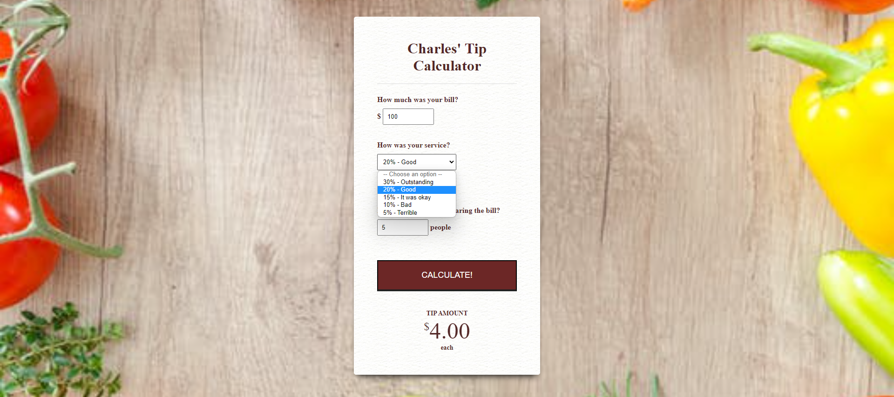

## Exercises

1. Generating the keyboard code code using even listener. The image below.

2. In order for this website to function, there are a number of buttons on the page that represent the various drums in a standard drum set, and when you click on any of those buttons, the accompanying drum sound will play. 
Additionally, you can create sound effects using the keyboard's keys.

After completing this project, you will not only have a better understanding of how to add event listeners to buttons and keystrokes so that you can recognise when a user is tapping the keyboard or clicking a specific button on your Website and react to it, but you will also have an awesome Website that will wow all of your friends.

[Checkout this website for refrence ](https://shreyajaiswal11.github.io/Drum-Kit/)

	
3. Tip Calculator

With this tip calculator, you won’t have to look around the table to determine who’s responsible for the tip. This tip Calculator is made with JavaScript, HTML, and CSS to help you figure out how much to tip at restaurants when the need arises. 
(total = (billAmount*serviceQuality)/ numPeople)

	

# steps to submit your assignments

- Complete the assignments listed above.
- Host the assignments.
- Provide the link below👇.

HOSTED LINK :  

