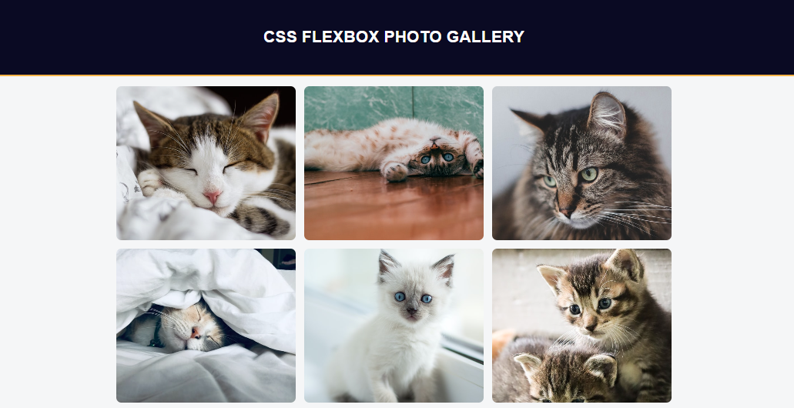
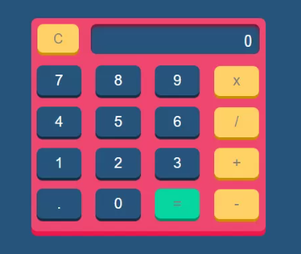
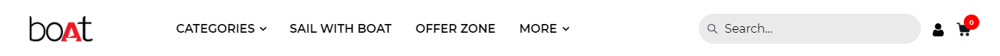
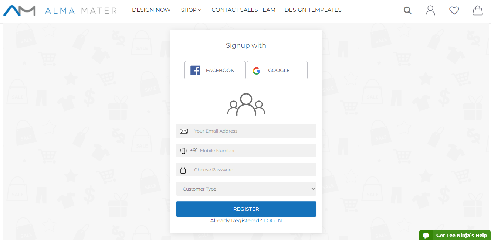

# End Projects

## Class Projects 

#### Project 1
https://www.freecodecamp.org/learn/2022/responsive-web-design/learn-css-flexbox-by-building-a-photo-gallery/step-21

#### Project 2

#### Project 3

#### Project 4

#### Project 5

#### Project 6

## Homework Projects

#### Project 1

#### Project 2

#### Project 3

#### Project 4

