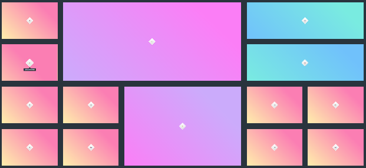
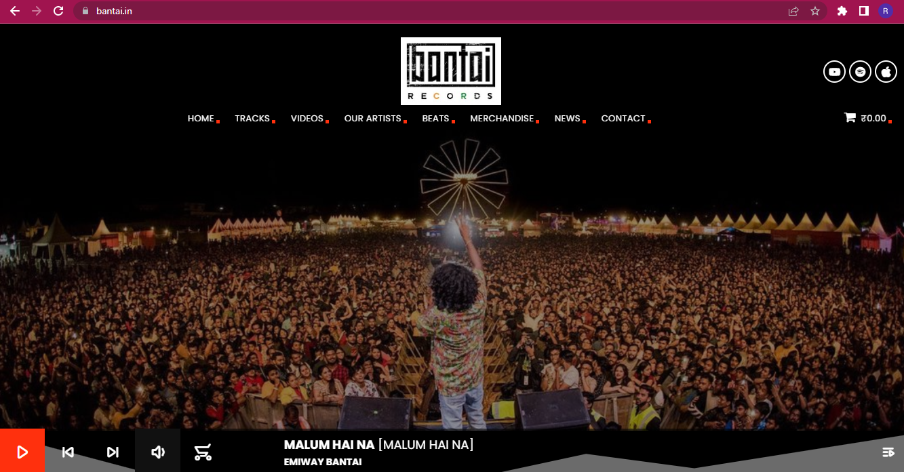

# Projects CSS-306

## Class Projects

#### Project CSS-306-01



<hr>

#### Project CSS-306-02

Go on this link and solve the challenges https://www.freecodecamp.org/learn/2022/responsive-web-design/learn-css-grid-by-building-a-magazine/step-1

<hr>

#### Project CSS-306-03


<hr>
<hr>

## Homework Projects

#### Project 4-306-04


<hr>
<hr>

## Additional Projects for practice

#### Project 5-306-05


<hr>

#### Project 6-306-06


<hr>

#### Project 7-306-07



<hr>

#### Project 8-306-08


# INSTRUCTIONS
- Complete all above assignments in their respective folders
- Html should be in ```index.html``` file and styling should be in ```style.css``` file