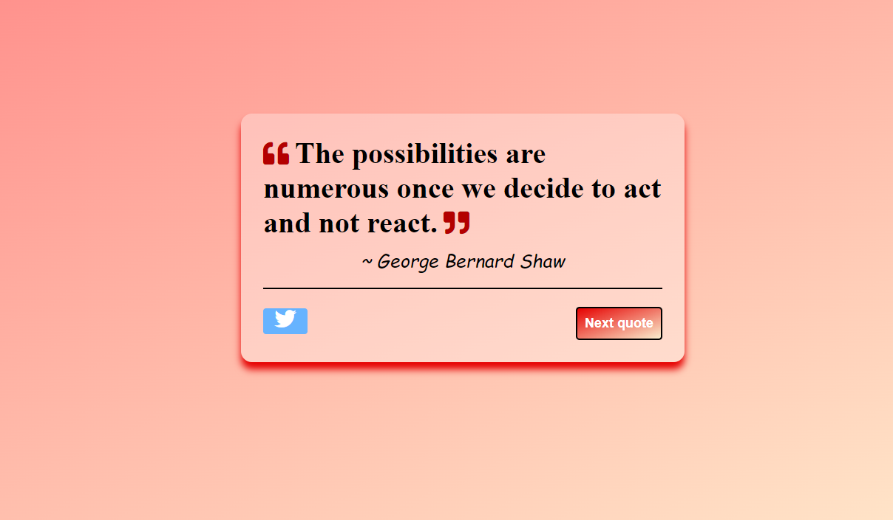

# A few engaging projects to hone your skill AdvanceJS-410

<hr>

## 1. Github Finder AdvanceJS-410-01

Do you want to stalk your friends on github? This app does that for you!

Get details of users by typing their name on searchbox.

API- https://api.github.com

feel free to explore this API refer this documentation [Click me👆](https://docs.github.com/en/developers/overview/about-githubs-apis)


<hr>

## 2. Dictionary app AdvanceJS-410-02

You have to build a web application that allows users to look up a word's definition using the Merriam-Webster API. It retrieves both the word's pronunciation and its definition.

API -https://www.dictionaryapi.com/api/v3/references/learners/json/apple?key=your-api-key (genrate your own api key)

feel free to explore this API refer this documentation [Click me👆](https://www.dictionaryapi.com/products/api-learners-dictionary)


<hr>

## 3. Meal finder AdvanceJS-410-03

You need to use Vanilla Javascript and the MealDB API to construct an online recipe search application.

API- https://www.themealdb.com/api/json/v1/1/search.php?s=sandwiches

feel free to explore this API refer this documentation [Click me👆](https://www.themealdb.com/api.php)


<hr>

## 4. Real-time Weather app AdvanceJS-410-04

For getting meteorological information, you can use the Dark Sky API, it is a terrific opportunity for you to learn how to communicate with APIs, which is another great thing you can do with JavaScript. 

API - https://api.openweathermap.org/data/3.0/onecall?lat=33.44&lon=-94.04&exclude=hourly,daily&appid={API-key}

feel free to explore this API refer this documentation [Click me👆](https://openweathermap.org/api/one-call-3)


## 5. Random Quote Generator Using HTML, CSS, and JavaScript AdvanceJS-410-05

fetch the data from API and then display the quotes in card format.

API- https://api.quotable.io/random 

- https://type.fit/api/quotes
  
 feel free to explore this API refer this documentation [Click me👆](https://github.com/lukePeavey/quotable)
 



<hr>

# Steps to submit your assignments

- Complete the assignments listed above in respective folders.
- Push the assignments.
- Add the link in ```./../README.md``` 


