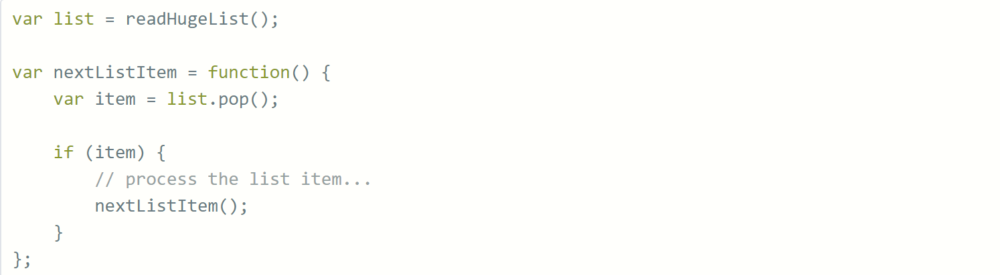
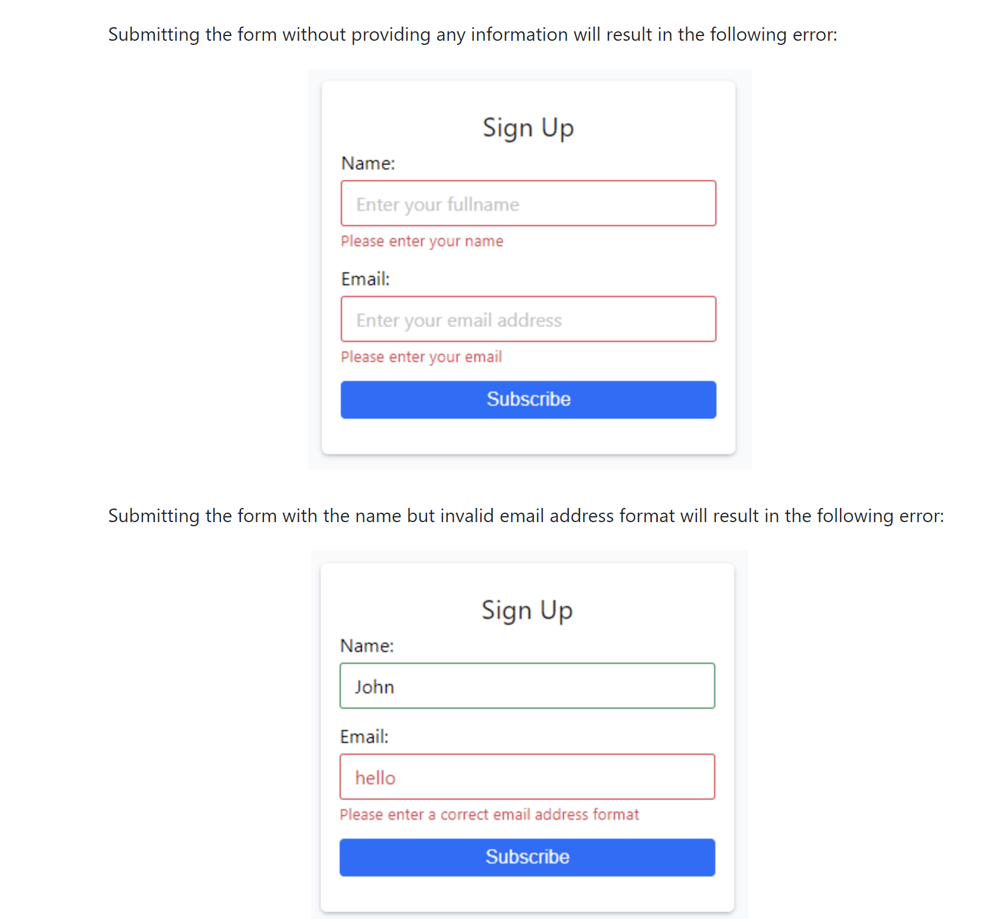

# Weekly-Test-2

### - An answer folder has been given to you below where you will be answering all the question
### - Do mention all the steps which you took to reach the final answer.

# Question 1.
### What are the unescape() and escape() functions in javascript with syntex?
 

# Question 2. 
### How to get the primitive value of a string in Javascript?

# Question 3.
### The following recursive code will cause a stack overflow if the array list is too large. How can you fix this and still retain the recursive pattern?

# Question 4.
### Make a signup form using Html, Css & Js.
# - Please refer to this image below:

