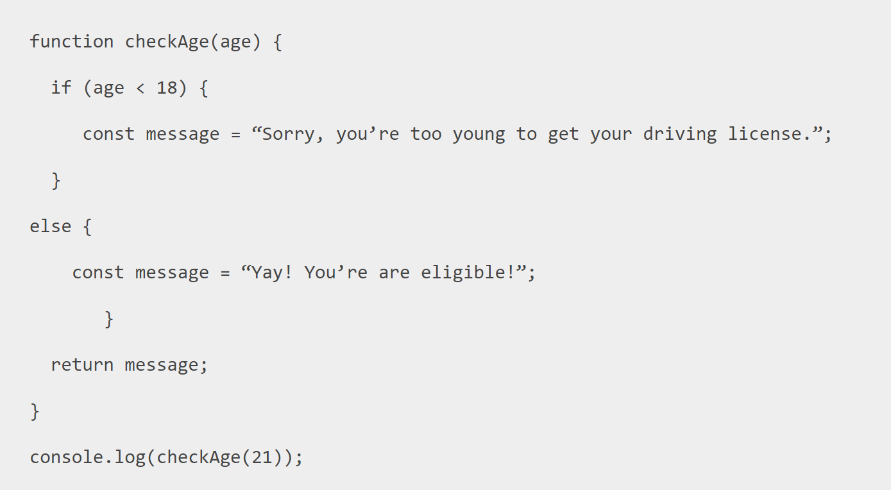
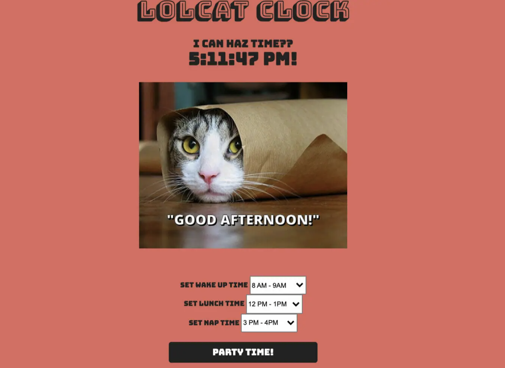

# Weekly-Test-4

### - An answer folder has been given to you below where you will be answering all the question
### - Do mention all the steps which you took to reach the final answer.

# Question 1.
### Create a button element with a value attribute set to “CLICK ME and WAIT” and invoke a click event on the button, which calls a function that changes the button’s text value color to red. At the same time, this function also sets up a timed function using setTimeout() that sets the text color back to black after 5 seconds.

# Question 2.
### What is the Output of following code.

# uestion 3.
### Function’s for converting a string of any base class to integer in JavaScript?

# Question 4.
### Make a webpage using Html, Css & Js.

### - Please refer to this image below:
### - Implement the JavaScript code so that every time you click the “Party Time!” button in the time range that you specify,you get a different LOLcat. You can set different times to see different images 

 

